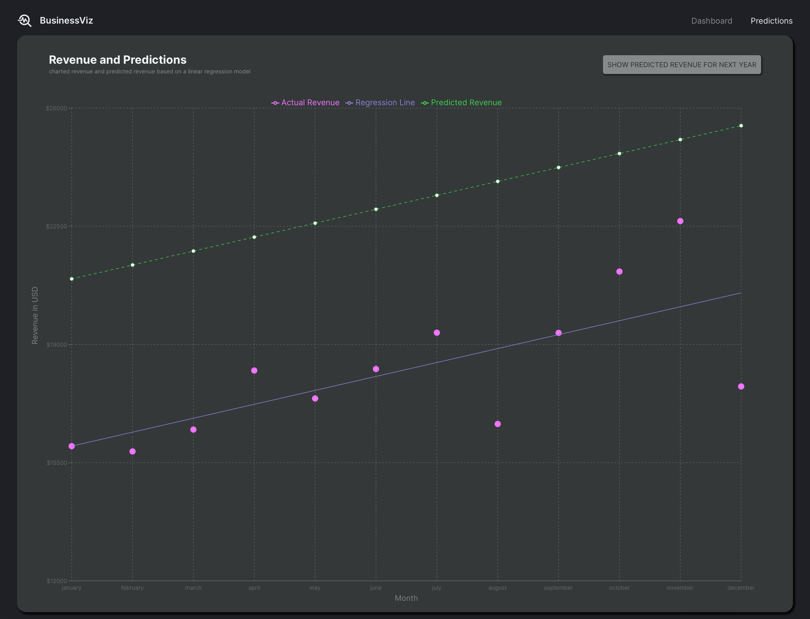

# Business Viz
A Financial Performance Dashboard Web Application

* The application offers real-time financial insights through intuitive UI, various data visualization and simple machine learning predictions.
* Leveraged Vite for starter application, Redux Toolkit for seamless state management, Material UI component library for a modern and user-friendly interface, and Recharts for dynamic and interactive charts visualization.
* Utilized Node.js as the runtime environment, Express.js framework to create a robust and flexible API backend, MongoDB to ensure efficient data storage and retrieval.

## Video Demo

## Snapshot

## Live Deployment
Download and run this application by running `npm run dev` in both server and client folder
